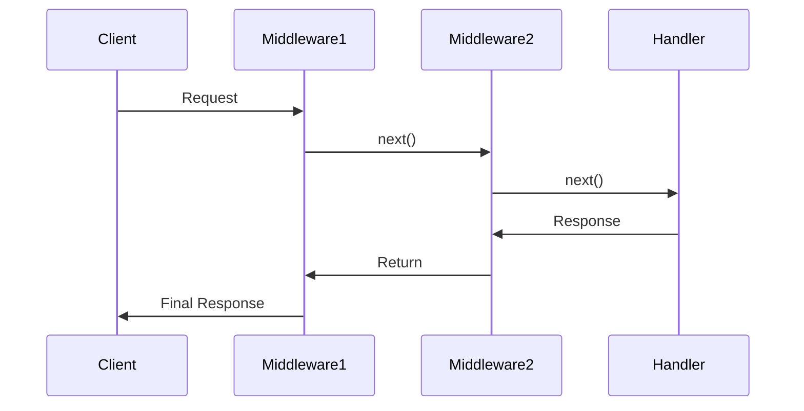

# **Middleware Guide**

## **Overview**

Middleware in `TezX` enables preprocessing of requests before they reach the final route handler. It’s ideal for tasks like authentication, logging, rate limiting, and more, with a flexible chainable design.

---

## **Core Types**

### **1. `Middleware<T>`**

Defines middleware that processes requests and optionally invokes the next step in the chain.

#### **Definition**

```typescript
type Middleware<T> = (
  ctx: ctx<T>,
  next: NextCallback,
) => NextCallback | Promise<TezResponse> | TezResponse;
```

- **Parameters**:
  - `ctx`: Typed context object with custom properties via `T`.
  - `next`: Callback to proceed to the next middleware or handler.
- **Returns**: `next()` (to continue), a `TezResponse`, or a `Promise<TezResponse>`.

#### **Example**

```typescript
const logger: Middleware<any> = async (ctx, next) => {
  console.log(`Request: ${ctx.req.method} ${ctx.req.pathname}`);
  return next();
};
```

---

### **2. `Callback<T>`**

Defines a final route handler that produces a response.

#### **Definition**

```typescript
type Callback<T> = (ctx: ctx<T>) => Promise<TezResponse> | TezResponse;
```

- **Parameters**: `ctx` (context object).
- **Returns**: A `TezResponse` or `Promise<TezResponse>`.

#### **Example**

```typescript
const handler: Callback<any> = (ctx) => {
  return ctx.json({ message: "Hello" });
};
```

---

### **3. `ctx<T>`**

A flexible context object combining framework features with custom properties.

#### **Definition**

```typescript
type ctx<T = {}> = Context<T> & T;
```

#### **Example**

```typescript
interface AuthContext {
  user: { id: number; name: string };
}

const authMiddleware: Middleware<AuthContext> = async (ctx, next) => {
  ctx.user = await getUser(ctx.headers.get("Authorization"));
  return next();
};
```

---

## **Middleware Registration (`use()`)**

The `use()` method registers middleware or sub-routers with flexible overloads.

### **Method Overloads**

| Signature             | Example                         | Description                           |
| --------------------- | ------------------------------- | ------------------------------------- |
| **Path + Middleware** | `.use("/api", auth)`            | Applies middleware to `/api` routes.  |
| **Path + Multiple**   | `.use("/admin", [auth, audit])` | Chains multiple middleware for path.  |
| **Path + Sub-Router** | `.use("/v1", v1Router)`         | Mounts a sub-router at `/v1`.         |
| **Global Middleware** | `.use(logger)`                  | Applies to all routes.                |
| **Multiple Global**   | `.use([cors, bodyParser])`      | Registers multiple global middleware. |

---

## **Usage Patterns**

### **1. Basic Middleware Chain**

```typescript
server
  .use(logger) // Logs all requests
  .use(cors()) // Adds CORS headers
  .get("/", (ctx) => ctx.text("Hello"));
```

### **2. Path-Scoped Middleware**

```typescript
app.use("/api", apiRateLimiter).group("/api", (group) => {
  group.use(authMiddleware);
  group.get("/data", fetchDataHandler);
});
// Routes: /api/data → [apiRateLimiter, authMiddleware, fetchDataHandler]
```

### **3. Mixed Middleware with Sub-Router**

```typescript
app.use(
  "/uploads",
  [fileFilter, diskStorage], // Middleware array
  uploadRouter, // Sub-router
);
```

---

## **Execution Order**

Middleware executes in registration order, with responses flowing back through the chain.



---

## **Best Practices**

### **1. Ordering**

- Register global middleware first, then path-specific middleware, and finally handlers.

```typescript
server
  .use(requestID) // Assigns unique IDs
  .use(logger) // Logs requests
  .use(errorHandler) // Catches errors last
  .get("/data", dataHandler);
```

### **2. Path Matching**

- **Wildcard Matching**: Use `*` for subpaths.

  ```typescript
  app.use("/api*", apiMiddleware); // Matches /api, /api/v1, etc.
  ```

- **Exact Matching**: Use precise paths.

  ```typescript
  app.use("/admin", adminAuth); // Matches /admin only
  ```

### **3. Type Safety**

- Extend context with generics for type-safe properties.

```typescript
interface AnalyticsContext {
  trackEvent: (name: string) => void;
}

app.use<AnalyticsContext>((ctx, next) => {
  ctx.trackEvent = (name) => analytics.log(name);
  return next();
});

app.get("/event", (ctx) => {
  ctx.trackEvent("PageView");
  return ctx.text("Tracked");
});
```

---

## **Common Recipes**

### **Authentication**

```typescript
const authCheck: Middleware<any> = async (ctx, next) => {
  if (!ctx.headers.get("Authorization")) {
    return ctx.status(401).json({ error: "Unauthorized" });
  }
  return next();
};

app.use("/dashboard", authCheck, (ctx) => {
  return ctx.html(dashboardTemplate(ctx.user));
});
```

### **Rate Limiting**

```typescript
const rateLimit = createRateLimiter({ limit: 100, windowMs: 60000 });
app.use("/api", rateLimit, apiHandler);
```

### **Request Validation**

```typescript
const validateSchema = (schema) => async (ctx, next) => {
  const body = await ctx.req.json();
  if (!schema.validate(body)) {
    return ctx.status(400).json({ error: "Invalid data" });
  }
  return next();
};

app.post("/submit", bodyParser(), validateSchema(submitSchema), submitHandler);
```

---

## **Performance Tips**

1. **Prioritize Synchronous Middleware**

   - Place synchronous middleware before asynchronous ones to reduce latency.

   ```typescript
   server
     .use(syncOperation) // Fast sync task
     .use(asyncMiddleware); // Slower async task
   ```

2. **Avoid Heavy Logic in Middleware**

   - Delegate intensive tasks to handlers.

   ```typescript
   // ❌ Avoid
   app.use(async (ctx, next) => {
     await processLargeFile();
     return next();
   });

   // ✅ Prefer
   app.get("/process", (ctx) => processLargeFile());
   ```

3. **Cache Repeated Operations**

   - Store results in the context to avoid redundant work.

   ```typescript
   app.use((ctx, next) => {
     ctx.cachedData = expensiveOperation();
     return next();
   });

   app.get("/data", (ctx) => ctx.json(ctx.cachedData));
   ```

---

## **Error Reference**

| **Error Pattern**                             | **Solution**                                              |
| --------------------------------------------- | --------------------------------------------------------- |
| `Type 'X' is not assignable to Middleware<T>` | Ensure middleware follows `(ctx, next) => ...` signature. |
| Missing `next()` call                         | Explicitly return `next()` or a `TezResponse`.            |
| Type mismatches in `ctx`                      | Verify generic `T` aligns across middleware and handlers. |

---
