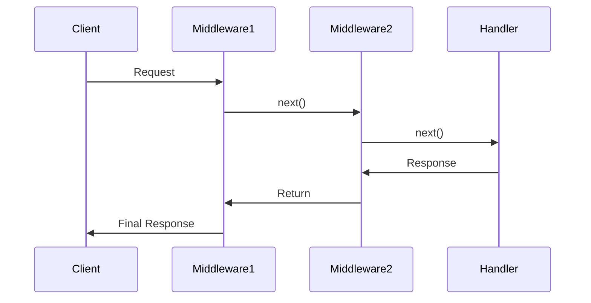

# **Middleware Guide**

Middleware allows handling requests before they reach the final route handler. It can be used for authentication, logging, rate limiting, etc.

---

## **Core Types**

### **1. `Middleware<T>`**

```typescript
type Middleware<T> = (
  ctx: ctx<T>,
  next: NextCallback,
) => NextCallback | Promise<TezResponse> | TezResponse;
```

- **Purpose**: Defines middleware that processes requests and optionally calls the next middleware or handler in the chain.
- **Parameters**:
  - `ctx`: The request context, typed with custom properties via `T`.
  - `next`: A callback to invoke the next middleware or handler.
- **Returns**: Either `next()` (to continue the chain), a `TezResponse`, or a `Promise<TezResponse>`.

**Example**:

```typescript
const logger: Middleware<any> = async (ctx, next) => {
  console.log(`Request: ${ctx.req.method} ${ctx.req.pathname}`);
  return next(); // Proceed to next middleware or handler
};
```

### **2. `Callback<T>`**

```typescript
type Callback<T> = (ctx: ctx<T>) => Promise<TezResponse> | TezResponse;
```

- **Purpose**: Defines a final request handler that does not invoke `next`.
- **Parameters**:
  - `ctx`: The request context.
- **Returns**: A `TezResponse` or `Promise<TezResponse>`.

**Example**:

```typescript
const handler: Callback<any> = (ctx) => {
  return ctx.json({ message: "Hello" });
};
```

### **3. `ctx<T>`**

```typescript
type ctx<T = {}> = Context<T> & T;
```

- **Purpose**: A flexible context object combining framework-provided properties (e.g., `req`, `json`) with custom user-defined properties via `T`.
- **Example**:

```typescript
interface AuthContext {
  user: User;
}

const authMiddleware: Middleware<AuthContext> = async (ctx, next) => {
  ctx.user = await getUser(ctx.headers.get("Authorization"));
  return next();
};
```

---

## **Middleware Registration (`use()`)**

The `use()` method registers middleware or sub-routers with flexible overloads.

### **Method Overloads**

| Signature             | Example                         | Description                          |
| --------------------- | ------------------------------- | ------------------------------------ |
| **Path + Middleware** | `.use('/api', auth)`            | Applies middleware to `/api` routes  |
| **Path + Multiple**   | `.use('/admin', [auth, audit])` | Chains multiple middleware for path  |
| **Path + Callback**   | `.use('/v1', v1Router)`         | Mounts a sub-router at `/v1`         |
| **Global Middleware** | `.use(logger)`                  | Applies middleware to all routes     |
| **Multiple Global**   | `.use([cors, bodyParser])`      | Registers multiple global middleware |

---

## **Usage Patterns**

### **1. Basic Middleware Chain**

```typescript
server
  .use(logger) // Logs all requests
  .use(cors()) // Adds CORS headers
  .get("/", (ctx) => ctx.text("Hello"));
```

### **2. Path-Scoped Middleware**

```typescript
server
  .use("/api", apiRateLimiter) // Rate limiting for /api routes
  .group("/api", (group) => {
    group.use(authMiddleware); // Authentication for /api sub-routes
    group.get("/data", fetchDataHandler);
  });
```

### **3. Mixed Middleware with Sub-Router**

```typescript
server.use(
  "/uploads",
  [fileFilter, diskStorage], // Middleware array for uploads
  uploadRouter, // Sub-router for upload routes
);
```

---

## **Execution Order**

Middleware executes in the order of registration, with responses flowing back through the chain.



---

## **Best Practices**

### **1. Ordering**

Register global middleware first, followed by path-specific middleware and handlers.

```typescript
server
  .use(requestID) // Assigns unique request IDs
  .use(logger) // Logs requests
  .use(errorHandler); // Catches errors last
```

### **2. Path Matching**

- **Wildcard Matching**: Use `*` for subpaths.

  ```typescript
  server.use("/api*", apiMiddleware); // Matches /api, /api/v1, etc.
  ```

- **Exact Matching**: Specify exact paths.

  ```typescript
  server.use("/admin", adminAuth); // Matches /admin only
  ```

### **3. Type Safety**

Leverage TypeScript generics for type-safe context extensions.

```typescript
interface AnalyticsContext {
  trackEvent: (name: string) => void;
}

server.use<AnalyticsContext>((ctx, next) => {
  ctx.trackEvent = (name) => analytics.log(name);
  return next();
});
```

---

## **Common Recipes**

### **Authentication**

```typescript
server.use("/dashboard", authCheck, (ctx) => {
  return ctx.html(dashboardTemplate(ctx.user));
});
```

### **Rate Limiting**

```typescript
const rateLimit = createRateLimiter({ limit: 100, windowMs: 60000 });
server.use("/api", rateLimit, apiHandler);
```

### **Request Validation**

```typescript
server.post(
  "/submit",
  bodyParser(),
  validateSchema(submitSchema),
  submitHandler,
);
```

---

## **Performance Tips**

1. **Prioritize Synchronous Middleware**

   - Place sync middleware before async to minimize overhead.

   ```typescript
   server
     .use(syncOperation) // Fast, synchronous
     .use(asyncMiddleware); // Slower, asynchronous
   ```

2. **Avoid Heavy Logic in Middleware**

   - Move intensive tasks (e.g., file processing) to handlers.

   ```typescript
   // ❌ Avoid in middleware
   await processLargeFile();

   // ✅ Use in handler
   server.get("/process", (ctx) => processLargeFile());
   ```

3. **Cache Repeated Operations**

   - Store results of expensive computations in the context.

   ```typescript
   server.use((ctx, next) => {
     ctx.cachedData = expensiveOperation();
     return next();
   });
   ```

---

## **Error Reference**

| Error Pattern                                 | Solution                                                  |
| --------------------------------------------- | --------------------------------------------------------- |
| `Type 'X' is not assignable to Middleware<T>` | Ensure middleware matches `(ctx, next) => ...` signature  |
| Missing `next()` call                         | Return `next()` or a `TezResponse` explicitly             |
| Type mismatches in `ctx`                      | Check generic type `T` aligns with middleware and handler |

---
