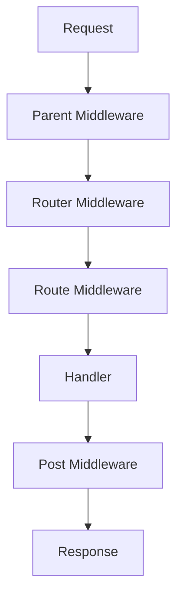

# **Router API**

## **Overview**

The `Router` class provides a hierarchical, type-safe routing system with support for middleware, route grouping, and nested routers. It enables modular and organized route management for web applications.

---

## **Core Concepts**

### **1. Router Class**

A flexible routing system with the following features:

| Feature              | Description                                   |
| -------------------- | --------------------------------------------- |
| **Nested Routing**   | Mount sub-routers with path prefixes.         |
| **Middleware Chain** | Execute pre- and post-processing middleware.  |
| **Path Isolation**   | Routes inherit parent path prefixes.          |
| **Type Propagation** | Maintain typed context across nested routers. |

---

### **2. Middleware System**

Middleware executes sequentially in a defined order.

#### **Execution Flow**



---

### **3. Route Groups**

Logically group routes with shared configuration and middleware.

#### **Example**

```ts
app.group("/admin", (group) => {
  group.use(adminAuth, auditLogger); // Shared middleware
  group.get("/users", getAdminUsers);
  group.post("/config", updateConfig);
});
// Routes: /admin/users, /admin/config
```

---

## **API Reference**

### **1. `addRouter(path: string, router: Router)`**

Mounts a sub-router under a specified path prefix.

#### **Parameters**

| Parameter | Type     | Description                      |
| --------- | -------- | -------------------------------- |
| `path`    | `string` | Base path for sub-router routes. |
| `router`  | `Router` | Configured sub-router instance.  |

#### **Example**

```ts
import { Router } from "tezx";

const authRouter = new Router()
  .post("/login", handleLogin)
  .get("/logout", handleLogout);

// Mount with prefix
app.addRouter("/auth", authRouter);
// Routes: /auth/login, /auth/logout
```

#### **With Middleware**

```ts
app.use("/auth", authRouter); // Supports middleware chain
```

#### **Restrictions**

- Wildcards (`/*`) and optional parameters (`:param?`) are **not supported** in `path`.
- Use `basePath` in the sub-router for dynamic parameters:

  ```ts
  const accountRouter = new Router<CustomContext>({
    basePath: "/account/:role?",
  });
  app.use("/accounts", accountRouter);
  ```

---

### **2. `group(prefix: string, callback: (router: Router) => void)`**

Creates a scoped route group with shared configuration.

#### **Parameters**

| Parameter  | Type       | Description                           |
| ---------- | ---------- | ------------------------------------- |
| `prefix`   | `string`   | Path prefix for the group.            |
| `callback` | `function` | Callback receiving a router instance. |

#### **Advanced Example**

```ts
app.group("/api/v1", (group) => {
  group.use(apiVersionHeader("v1"), rateLimiter);

  // Nested group
  group.group("/users", (userGroup) => {
    userGroup.get("/:id", getUser);
    userGroup.patch("/:id", updateUser);
  });

  group.delete("/posts/:id", deletePost);
});
// Routes: /api/v1/users/123, /api/v1/posts/456
```

#### **Notes**

- Supports dynamic parameters (e.g., `:id`), optional parameters (e.g., `:id?`), and wildcards (e.g., `*path`).

---

## **Advanced Configuration**

### **1. Middleware Scoping**

Apply middleware at different levels.

#### **Examples**

```ts
// Global middleware
app.use(loggingMiddleware);

// Router-specific middleware
const paymentRouter = new Router()
  .use(validateCreditCard)
  .post("/charge", processPayment);

// Route-specific middleware
app.get("/admin/stats", [adminAuth, geolock], getStatistics);
```

---

### **2. Context Propagation**

Ensure type-safe context inheritance across routers.

#### **Example**

```ts
interface CustomContext {
  user?: { id: number; email: string };
  requestId: string;
}

const app = new Router<CustomContext>();
app.use((ctx, next) => {
  ctx.requestId = crypto.randomUUID();
  return next();
});

app.get("/profile", (ctx) => {
  return ctx.json({ id: ctx.requestId });
});
```

---

### **3. Not Found Handler**

Customize the 404 response with descending overwrite behavior (parent to child).

#### **Example**

```ts
app.notFound((ctx) => {
  return ctx.text("Custom 404 Message", 404);
});
```

---

### **4. Error Handler**

Customize error responses with descending overwrite behavior.

#### **Example**

```ts
app.onError((error, ctx) => {
  return ctx.text(error.message, 500);
});
```

---

## **Best Practices**

### **1. Route Organization**

Structure routes in a modular directory layout.

#### **Example**

```bash
routes/
├── auth/
│   ├── login.ts
│   └── logout.ts
├── api/
│   ├── v1/
│   │   └── users.ts
│   └── v2/
│       └── users.ts
```

#### **Implementation**

```ts
import authRoutes from "./routes/auth";
import apiV1Routes from "./routes/api/v1";

app.use("/auth", authRoutes);
app.use("/api/v1", apiV1Routes);
```

---

### **2. Middleware Ordering**

- Place authentication and validation middleware early.
- Apply route-specific middleware close to handlers.

#### **Example**

```ts
app.use(authMiddleware); // Global
app.group("/secure", (group) => {
  group.use(rateLimiter); // Group-specific
  group.get("/data", [cacheMiddleware], getData); // Route-specific
});
```

---

### **3. Error and Not Found Handling**

- Define fallback handlers at the top level and override in sub-routers as needed.

```ts
app.notFound((ctx) => ctx.text("Not Found", 404));
app.onError((err, ctx) => ctx.text("Server Error", 500));

const subRouter = new Router().notFound((ctx) =>
  ctx.text("Sub-router 404", 404),
);
app.use("/sub", subRouter); // Overrides parent notFound
```

---
