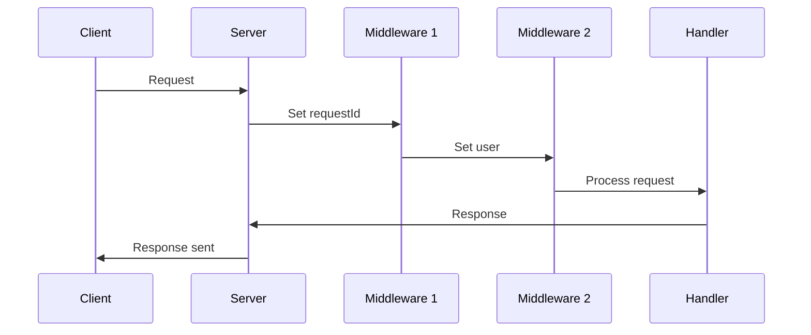

# **Context Propagation**

## **Overview**

Context propagation enables type-safe sharing of request-scoped data across middleware and route handlers. By leveraging TypeScript, it ensures strict type validation and supports hierarchical context extension, making it a robust solution for managing request-specific state.

---

## **Core Concepts**

### **1. Type-Safe Context Definition**

Define the context shape using a TypeScript interface to enforce type safety.

#### **Example**

```ts
interface CustomContext {
  user?: { id: number; email: string }; // Optional user data
  requestId: string; // Required request identifier
}
```

---

### **2. Router Initialization**

Initialize the router with your custom context type.

#### **Example**

```ts
import { Router } from "tezx";
const app = new Router<CustomContext>();
```

---

### **3. Middleware Implementation**

Enrich the context with middleware, leveraging full type safety.

#### **Example**

```ts
// Add authentication data
app.use(async (ctx, next) => {
  ctx.user = await authenticateRequest(ctx.request);
  return next();
});

// Add request ID
app.use((ctx, next) => {
  ctx.requestId = crypto.randomUUID();
  return next();
});
```

---

### **4. Handler Access**

Access context properties in route handlers with type inference.

#### **Example**

```ts
app.get("/profile", (ctx) => {
  return Response.json({
    id: ctx.requestId, // Required: string
    user: ctx.user?.email, // Optional: string | undefined
  });
});
```

---

## **Advanced Features**

### **Context Composition**

Combine multiple context types for modular applications.

#### **Example**

```ts
interface AuthContext {
  user: { id: number; email: string };
  session: { token: string; expires: Date };
}

interface LoggingContext {
  logger: Logger;
  requestStart: number;
}

type AppContext = AuthContext & LoggingContext;

const app = new Router<AppContext>();
```

---

### **Validation Middleware**

Ensure context integrity with runtime checks.

#### **Example**

```ts
app.use((ctx, next) => {
  if (!ctx.requestId) {
    throw new Error("Missing request ID");
  }
  return next();
});
```

---

## **Error Handling**

### **Type Safety Guards**

TypeScript prevents invalid property access or type mismatches at compile time.

#### **Example**

```ts
app.use((ctx, next) => {
  // Error: Property 'newProp' does not exist on CustomContext
  ctx.newProp = "value";
  // Error: Type 'number' is not assignable to 'string'
  ctx.requestId = 123;
  return next();
});
```

---

### **Optional Properties**

Handle optional context fields safely.

#### **Example**

```ts
app.get("/public", (ctx) => {
  return ctx.user
    ? Response.json(ctx.user)
    : Response.json({ error: "Unauthorized" }, 401);
});
```

---

## **Best Practices**

### **1. Initialization Order**

- Set critical context properties early in the middleware chain.
- Place validation middleware after initialization.

#### **Example**

```ts
app.use((ctx, next) => {
  ctx.requestId = crypto.randomUUID();
  return next();
});
app.use((ctx, next) => {
  if (!ctx.requestId) throw new Error("Request ID missing");
  return next();
});
```

---

### **2. Immutability**

Avoid mutating context objects directly; create new objects instead.

#### **Example**

```ts
// Avoid
ctx.user = { ...ctx.user, email: "new@example.com" };

// Prefer
const updatedUser = { ...ctx.user, email: "new@example.com" };
ctx.user = updatedUser;
```

---

### **3. Testing Patterns**

Mock context objects for unit tests.

#### **Example**

```ts
const testCtx: CustomContext = {
  requestId: "test-123",
  user: { id: 1, email: "test@example.com" },
};

// Test handler
const response = await handler(testCtx);
```

---

## **Context Lifecycle**

1. **Initialization**: Context is created for each request.
2. **Middleware Processing**: Middleware enriches the context.
3. **Handler Execution**: Handlers access and utilize the context.
4. **Cleanup Hooks**: Context is discarded after response (optional cleanup via middleware).

#### **Diagram**



---

## **Benefits**

- **Type Safety**: Prevents runtime errors with compile-time checks.
- **Modularity**: Supports composition of context types for complex applications.
- **Scalability**: Easily extend context for new features or middleware.

---
