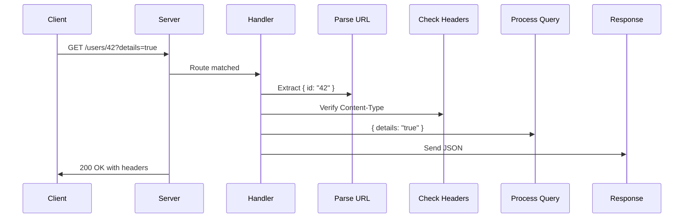

# **Request Handling API**

This section details the APIs available for handling HTTP requests, including methods, URL parsing, query parameters, route parameters, headers, and body parsing.

---

## **1. Method**

### **Description**

Retrieves the HTTP request method (e.g., `GET`, `POST`, `PUT`, `DELETE`).

### **Property**

- `ctx.req.method: string` – Read-only, uppercase string.

### **Example**

```typescript
app.post("/users", (ctx) => {
  if (ctx.req.method === "POST") {
    // Handle user creation
    return ctx.json({ message: "User created" });
  }
});
```

---

## **2. URL Reference (`urlRef`)**

### **Description**

Provides deconstructed components of the request URL.

### **Interface**

```typescript
interface UrlRef {
  hash?: string;          // e.g., "#section"
  protocol?: string;      // e.g., "https:"
  origin?: string;        // e.g., "https://example.com:8080"
  username?: string;      // Auth username
  password?: string;      // Auth password
  hostname?: string;      // e.g., "example.com"
  port?: string;          // e.g., "8080"
  href?: string;          // Full URL
  query: Record<string, string>; // Parsed query params
  pathname: string;       // e.g., "/api/v2/users"
}
```

### **Usage**

```typescript
app.get("/profile", (ctx) => {
  const url = ctx.req.urlRef;
  // For URL: "https://api.com:8080/users?id=123#details"
  console.log(url.port);    // "8080"
  console.log(url.hostname); // "api.com"
  console.log(url.query);   // { id: "123" }
  console.log(url.hash);    // "details"
});
```

### **Note**

- Missing components return `undefined`.

---

## **3. Query Parameters (`query`)**

### **Description**

Accesses parsed query string parameters from the URL.

### **Behavior**

- Decodes URL-encoded values.
- Last value wins for duplicate keys.
- Returns an empty object (`{}`) if no query parameters exist.

### **Example**

```typescript
// URL: /search?q=term&page=2&filter=new
app.get("/search", (ctx) => {
  const query = ctx.req.query;
  // { q: "term", page: "2", filter: "new" }
  const page = query.page || "1";
  return ctx.json({ page });
});
```

---

## **4. Dynamic Parameters (`params`)**

### **Description**

Captures route parameters from dynamic path patterns.

### **Supported Patterns**

| Pattern   | Example Route       | Request Path            | Result                    |
|-----------|---------------------|-------------------------|---------------------------|
| `:param`  | `/users/:id`        | `/users/42`             | `{ id: "42" }`            |
| `:param?` | `/archive/:year?`   | `/archive`              | `{ year: undefined }`     |
| `*`       | `/files/*path`      | `/files/docs/readme`    | `{ path: "docs/readme" }` |

### **Example**

```typescript
app.get("/users/:id/posts/:slug*", (ctx) => {
  const params = ctx.req.params;
  // For /users/42/posts/announcements/2023
  // { id: "42", slug: "announcements/2023" }
  return ctx.json(params);
});
```

### **Best Practice**

```typescript
app.get("/products/:id", (ctx) => {
  const id = parseInt(ctx.req.params.id);
  if (isNaN(id)) return ctx.status(400).text("Invalid ID");
  return ctx.json({ productId: id });
});
```

---

## **5. Headers (`headers`)**

### **Description**

Accesses and modifies request and response headers.

### **Usage**

```typescript
app.get("/secure", (ctx) => {
  // Get request header
  const auth = ctx.req.headers.get("authorization");

  // Set response headers
  ctx.headers
    .set("Cache-Control", "max-age=3600")
    .set("X-Response-Time", Date.now().toString());

  if (auth) return ctx.text("Authorized");
  return ctx.status(401).text("Unauthorized");
});
```

### **Common Operations**

- Check `Content-Type`:

  ```typescript
  if (ctx.req.headers.get("content-type") === "application/json") {
    // Handle JSON request
  }
  ```

---

## **Request Flow Diagram**



---

## **6. Body Parser**

### **Description**

Parses request bodies based on `Content-Type`.

### **Supported Formats**

| Method       | Content-Type                          | Features                   |
|--------------|---------------------------------------|----------------------------|
| `text()`     | `text/plain`                          | Raw text parsing           |
| `json()`     | `application/json`                    | JSON parsing/validation    |
| `formData()` | `multipart/form-data`<br>`application/x-www-form-urlencoded` | Form fields + file uploads |

---

### **1. Text Parsing**

#### **Use Case**

Plain text, XML, CSV, or custom formats.

#### **Example**

```typescript
app.post("/raw", async (ctx) => {
  try {
    const text = await ctx.req.text();
    return ctx.text(`Received: ${text}`);
  } catch (error) {
    return ctx.status(400).text("Invalid payload");
  }
});
```

#### **Config**

- `maxBodySize`: Limits payload size (configurable).

---

### **2. JSON Parsing**

#### **Behavior**

Validates and parses JSON payloads.

#### **Example**

```typescript
app.post("/data", async (ctx) => {
  try {
    const data = await ctx.req.json();
    return ctx.json({ received: data });
  } catch (error) {
    return ctx.status(422).json({ error: "Invalid JSON" });
  }
});
```

---

### **3. Form Data Handling**

#### **URL-Encoded Forms**

```typescript
app.post("/login", async (ctx) => {
  const form = await ctx.req.formData();
  const username = form.username; // "john_doe"
  return ctx.json({ username });
});
```

#### **Multipart File Uploads**

```typescript
const config = {
  maxFileSize: 50 * 1024 * 1024, // 50MB
  allowedTypes: ["image/jpeg", "application/pdf"],
};

app.post("/upload", async (ctx) => {
  const form = await ctx.req.formData(config);
  const file = form.avatar as File;
  const buffer = await file.arrayBuffer();
  writeFileSync(`./uploads/${file.name}`, Buffer.from(buffer));
  return ctx.json({ file: file.name });
});
```

---

### **4. File Upload Example**

#### **Route Handler**

```typescript
app.post("/upload", async (ctx) => {
  try {
    const form = await ctx.req.formData();
    const files = form.attachments;
    const results = [];

    if (Array.isArray(files)) {
      for (const file of files) {
        const sanitizedName = sanitizeFilename(file.name);
        const path = `./uploads/${sanitizedName}`;
        await writeFile(path, await file.arrayBuffer());
        results.push({ name: sanitizedName, status: "success" });
      }
    }

    return ctx.json({ results });
  } catch (error) {
    return ctx.status(500).json({ error: "Upload failed" });
  }
});
```

#### **Client-Side**

```javascript
const form = new FormData();
form.append("attachments", fileInput.files[0]);

fetch("/upload", {
  method: "POST",
  body: form,
});
```

---

## **Best Practices**

- **Validation**: Always validate `params` and `query` values (e.g., type checking).
- **Error Handling**: Use try-catch with body parsers to handle malformed data.
- **Security**: Sanitize file names and restrict upload types/sizes.

---
