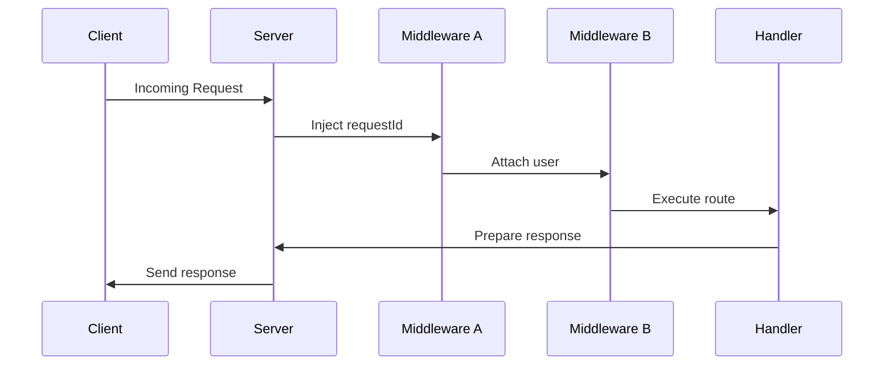

# 🧩 **Context Propagation**

Context propagation in **TezX** allows **type-safe**, **request-scoped state sharing** across middleware and route handlers. Built on TypeScript, it enables fine-grained control, promotes modular architecture, and enhances developer productivity through strict typing and tooling support.

---

## 🧠 **Conceptual Overview**

* **Type-safe context shape**
* **Scoped to individual requests**
* **Mutable across middleware**
* **Extended through type composition**

---

## 1️⃣ **Defining a Typed Context**

Create a strongly-typed interface to define the structure of your request context.

```ts
interface CustomContext {
  user?: { id: number; email: string }; // Optional user data
  requestId: string; // Required unique identifier per request
}
```

---

## 2️⃣ **Typed Router Instantiation**

Pass the context type to `Router` or `TezX` for strict type enforcement.

```ts
import { TezX } from "tezx";

const app = new TezX<CustomContext>();
```

---

## 3️⃣ **Injecting Data via Middleware**

Use middleware to enrich the context during the request lifecycle.

```ts
app.use(async (ctx, next) => {
  ctx.user = await authenticate(ctx.req);
  return next();
});

app.use((ctx, next) => {
  ctx.requestId = crypto.randomUUID();
  return next();
});
```

---

## 4️⃣ **Typed Context Access in Handlers**

Safely access your context properties in any handler with full IntelliSense support.

```ts
app.get("/me", (ctx) => {
  return ctx.json({
    requestId: ctx.requestId,
    email: ctx.user?.email ?? "Anonymous",
  });
});
```

---

## 🔁 **Context Composition**

Scale your context by composing smaller types:

```ts
interface AuthContext {
  user: { id: number; email: string };
  session: { token: string; expires: Date };
}

interface MetricsContext {
  logger: Logger;
  startTime: number;
}

type AppContext = AuthContext & MetricsContext;

const app = new TezX<AppContext>();
```

---

## 🛡️ **Validation Middleware**

Ensure the presence of critical fields during runtime:

```ts
app.use((ctx, next) => {
  if (!ctx.requestId) throw new Error("Missing request ID");
  return next();
});
```

---

## ❌ **Type Safety Guards**

TypeScript prevents invalid usage and ensures refactor-safe access:

```ts
// ❌ Property 'newProp' does not exist
ctx.newProp = "value";

// ❌ Type mismatch
ctx.requestId = 123; // should be a string
```

---

## 🧩 **Optional Properties Handling**

Use safe access patterns for optional context data:

```ts
app.get("/dashboard", (ctx) => {
  if (!ctx.user) return ctx.status(401).json({ error: "Unauthorized" });

  return ctx.json({ email: ctx.user.email });
});
```

---

## 📌 **Best Practices**

### ✅ **Order Matters**

Set required context early and validate immediately after.

```ts
app.use((ctx, next) => {
  ctx.requestId = crypto.randomUUID();
  return next();
});

app.use((ctx, next) => {
  if (!ctx.requestId) throw new Error("Missing ID");
  return next();
});
```

---

### ✅ **Immutability**

Prefer immutable patterns when modifying nested context objects.

```ts
// Prefer
ctx.user = { ...ctx.user, email: "updated@example.com" };
```

---

### ✅ **Testing with Mock Context**

Test your logic in isolation with mock context objects.

```ts
const mockCtx: CustomContext = {
  requestId: "req-test-001",
  user: { id: 1, email: "test@example.com" },
};

const response = await handler(mockCtx);
```

---

## 🔄 **Context Lifecycle Overview**



---

## 🎯 **Why Context Propagation?**

| Benefit            | Description                                                            |
| ------------------ | ---------------------------------------------------------------------- |
| 🔐 Type Safety     | Compile-time validation prevents access errors and invalid mutations   |
| 🧩 Modularity      | Enables context slicing and extension across layers                    |
| ⚙️ Maintainability | Clear structure for evolving app concerns like auth, logging, sessions |
| 🚀 Scalability     | Composable and predictable patterns for large applications             |

---

## 🧵 Extendability Tips

* Extend context per domain: `AuthContext`, `TraceContext`, `FeatureFlagContext`, etc.
* Use utility types for safer extensions: `Partial<>`, `Pick<>`, etc.
* Compose middlewares using domain isolation and shared contracts.

---
