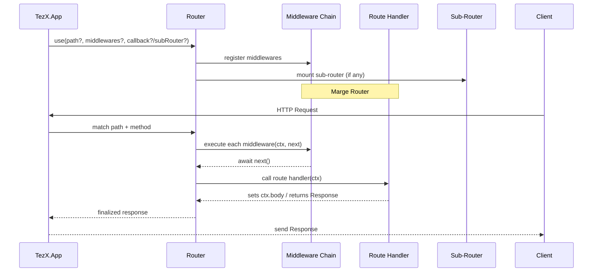

# 🧩 `use()` – Register Middlewares or Routers

The `use()` method in `TezX.Router` is a powerful, flexible API for registering middlewares and sub-routers — either globally or scoped to a specific path.

## Sequence Diagram – Middleware / Router Chain



---

## 📚 **Function Signature**

```ts
use(...args: any[]): this;
```

Supports overloads like:

```ts
// Global middleware
use(middleware);
use([middleware1, middleware2]);

// Scoped middleware
use("/path", middleware);
use("/path", [middleware1, middleware2]);

// Middleware + handler or router
use("/path", middleware, callback);
use("/path", [middleware1], subRouter);
use(middleware, callback);
use([middleware], subRouter);
```

---

## 📦 **Middleware Type**

```ts
type Middleware<T = {}, Path extends string = any> = (
  ctx: Ctx<T, Path>,
  next: () => Promise<void>
) => Response | Promise<Response | void>;
```

* Receives a request context (`ctx`) and a `next()` callback.
* Can **modify `ctx`**, **short-circuit**, or **continue** the chain with `await next()`.

---

## 🧪 **Usage Examples**

### 1. **Global Middleware**

```ts
app.use(async (ctx, next) => {
  console.log("Request started");
  await next();
  console.log("Request ended");
});
```

### 2. **Multiple Global Middlewares**

```ts
app.use([
  loggerMiddleware,
  requestIDMiddleware,
  timingMiddleware
]);
```

### 3. **Scoped Middleware by Path**

```ts
app.use("/admin/:section?", async (ctx, next) => {
  if (!ctx.user?.isAdmin) {
    return ctx.status(403).text("Forbidden");
  }
  return next();
});
```

---

### 4. **Scoped Middleware with Sub-Router**

```ts
const authRouter = new Router();

authRouter.get("/login", (ctx) => ctx.text("Login page"));

app.use("/auth/:provider?", authMiddleware, authRouter);
```

---

## 🧠 **How It Works Internally**

The `use()` function:

* Normalizes arguments into `path`, `middlewares`, and optional `router`.
* Registers middlewares using:

```ts
this.#addRoute("ALL", path, middlewares);
```

* If a `Router` is passed, it’s mounted using:

```ts
this.addRouter(path, router);
```

* Middleware paths support **all route param syntaxes** (`:id`, `:id?`, `*wildcard`).

---

## 🔁 **Middleware Chaining**

All middleware functions follow a **chainable model** via `next()`:

```ts
app.use(async (ctx, next) => {
  ctx.startTime = Date.now();
  await next();
  const ms = Date.now() - ctx.startTime;
  console.log(`${ctx.method} ${ctx.pathname} - ${ms}ms`);
});
```

* Each middleware may perform actions **before or after** the next one.
* If `next()` is not called, the chain stops.

---

## 🧱 **Router Composition**

```ts
const v1 = new Router();
v1.use("/users", authMiddleware, userRouter);

const v2 = new Router();
v2.use("/products", productRouter);

app.use("/api", [loggerMiddleware], v1);
app.use("/api", v2);
```

---

## 🛡️ **Best Practices**

| Tip                           | Description                                        |
| ----------------------------- | -------------------------------------------------- |
| ✅ Use scoped middleware       | For route-specific logic like authentication       |
| ✅ Keep global middleware pure | Logging, CORS, rate limiting, etc.                 |
| ✅ Chain with `next()`         | Enables layered composition                        |
| ✅ Compose routers             | Modularize APIs or feature groups                  |
| ✅ Handle errors               | Wrap logic in try/catch or global error middleware |

---
