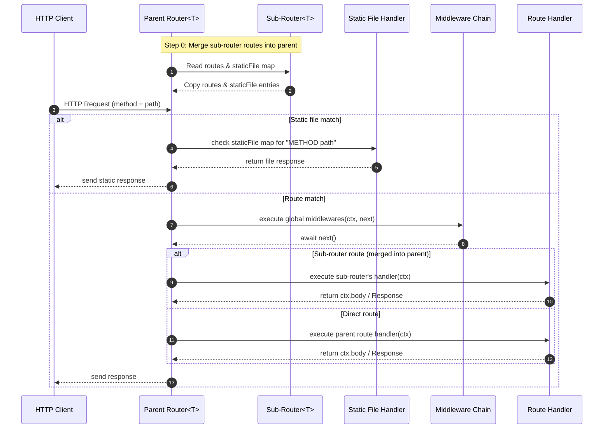

# 🚀 TezX Router

**TezX Router** is the core of the **tezx** web framework. It offers a **high-performance, flexible, and modern** way to handle:

* HTTP routing
* Middleware chaining
* Static assets
* Sub-routers
* Server-Sent Events (SSE)

Whether you’re building small APIs or large modular applications, TezX Router provides the structure and tools you need.



---

## 1. Installation & Initialization

```ts
import { Router } from "tezx";

// Create a new Router instance
const app = new Router({
  basePath: "/",            // Base path for all routes (default: "/")
  env: { NODE_ENV: "prod" } // Environment variables accessible in middleware
});
```

### Router Configuration Options

```ts
export type RouterConfig = {
  /** Custom route registry used internally */
  routeRegistry?: RouteRegistry;

  /** Optional segments handling (ignored by RadixRouter internally) */
  optionalSegments?: {
    expand?: boolean;           // Always true internally
    maxExpansion?: number;      // Maximum number of optional segment permutations (default: 6)
  };

  /** Environment variables for this router instance */
  env?: Record<string, string | number>;

  /** Base path prefix for all routes (e.g., "/api/v1") */
  basePath?: string;
};
```

**Notes:**

* Optional segments (`?`) expand internally into all permutations.
* Use `basePath` to mount routers under a sub-path.

---

## 2. Core Concepts

TezX Router revolves around a few key ideas:

1. **Route registration** — Define endpoints with HTTP verbs (`GET`, `POST`, etc.).
2. **Middleware chaining** — Reusable pre-processing or validation logic.
3. **Route grouping** — Organize routes under common prefixes.
4. **Sub-routers** — Modularize large APIs by mounting routers on paths.
5. **Static file serving** — Serve assets like images, CSS, and JS.

---

## 3. Defining Routes

### 3.1 Basic Route

```ts
app.get("/hello", (ctx) => {
  ctx.body = "Hello from TezX!";
});
```

* `ctx` contains request info, parameters, and response methods.
* Set responses using `ctx.body`, `ctx.text()`, or `ctx.json()`.

---

### 3.2 Route with Middleware

```ts
const auth = async (ctx, next) => {
  if (!ctx.user) {
    ctx.setStatus = 401;
    return ctx.text("Unauthorized");
  }
  await next();
};

app.get("/profile", auth, (ctx) => {
  return ctx.json({ user: ctx.user });
});
```

* Middleware is a function `(ctx, next)` that can halt or continue the request chain.
* Call `await next()` to proceed to the next middleware or handler.

---

### 3.3 Multiple Middlewares

```ts
const log = (ctx, next) => {
  console.log(`${ctx.method} ${ctx.pathname}`);
  return next();
};

const adminOnly = (ctx, next) => {
  if (!ctx.user?.isAdmin) {
    ctx.setStatus = 403;
    return ctx.text("Forbidden");
  }
  return next();
};

app.get("/admin/dashboard", [auth, log, adminOnly], (ctx) => {
  return { body: "Admin Dashboard" };
});
```

* Middleware can be applied as an array for **chained execution**.
* Allows reusable, composable logic like logging, authentication, or authorization.

---

## 4. HTTP Methods

TezX Router supports standard HTTP verbs:

```ts
app.get("/path", ...middlewares, handler)
app.post("/path", ...middlewares, handler)
app.put("/path", ...middlewares, handler)
app.patch("/path", ...middlewares, handler)
app.delete("/path", ...middlewares, handler)
app.options("/path", ...middlewares, handler)
app.all("/path", ...middlewares, handler);
```

Example:

```ts
app.post("/submit", (ctx) => {
  const data = ctx.request.body;
  return ctx.json({ received: data });
});
```

```ts
app.all("/path", ...middlewares, handler);
```

**Explanation:**

* `app.all()` is primarily used to **register middleware** that should run for **all HTTP methods** (GET, POST, PUT, DELETE, etc.) for a given path.
* Middleware functions in `...middlewares` are executed **in order** before the final `handler`.
* **Optional route parameters are not supported** in `app.all()` — the path must be **explicit and exact**.
* Use it to apply global or reusable middleware logic on a specific path.

**Example:**

```ts
// Middleware that runs for all methods on "/dashboard"
app.all("/dashboard", authMiddleware, logMiddleware, (ctx) => {
  return ctx.text("Dashboard accessed!");
});
```

> **Note:** `.all()` is mainly used for middleware or global handlers, not optional parameters.

---

## 5. Serving Static Files

```ts
// Bun
import { serveStatic } from "tezx/bun";
// Node.js
import { serveStatic } from "tezx/node";
// Deno
import { serveStatic } from "tezx/deno";

app.static(serveStatic("/assets", "./public/assets"));  // Serve under route
app.static(serveStatic("./public"));                     // Serve at root
```

* Use for images, CSS, JS, or any public assets.

---

## 6. Grouping Routes

```ts
app.group("/api/v1", (router) => {
  router.get("/users", (ctx) => { /*...*/ });
  router.post("/users", (ctx) => { /*...*/ });
});
```

* Groups create **scoped sub-routers** for modular organization.
* You can attach middlewares to the group.

---

## 7. Mounting Sub-Routers

```ts
const adminRouter = new Router();
adminRouter.use(auth); // Auth applies to all admin routes

adminRouter.get("/dashboard", (ctx) => ctx.text("Welcome, admin!"));

app.addRouter("/admin", adminRouter);
```

* Sub-routers can have their own middlewares, groups, and routes.
* `addRouter()` mounts the sub-router at a base path.

---

## 8. Middleware Usage Tips

* Middleware signature: `async (ctx, next) => { ... }`
* Always call `await next()` unless you want to **short-circuit**.
* Attach data to `ctx` (e.g., `ctx.user = {...}`).
* Arrays of middlewares can be applied to routes, groups, or routers.

---

## 9. Full Example Mini App

```ts
import { Router } from "tezx";
// Bun
import { serveStatic } from "tezx/bun";
// Node.js
import { serveStatic } from "tezx/node";
// Deno
import { serveStatic } from "tezx/deno";

const app = new Router();

const logger = async (ctx, next) => {
  console.log(`${ctx.method} ${ctx.pathname}`);
  await next();
};

const auth = async (ctx, next) => {
  const token = ctx.headers["authorization"];
  if (token !== "secret-token") {
    ctx.setStatus = 401;
    return ctx.text("Unauthorized");
  }
  ctx.user = { name: "Alice" };
  await next();
};

app.use(logger);

app.get("/", (ctx) => ctx.text("Welcome to TezX Router!"));

app.group("/api", (api) => {
  api.get("/public", (ctx) => ctx.text("Public API data"));
  api.get("/private", auth, (ctx) =>
    ctx.text(`Hello ${ctx.user.name}, this is private data.`)
  );
});

app.static(serveStatic("/static", "./public"));

export default app;
```

---

## Troubleshooting & Gotchas

* **Optional param expansion:** RadixRouter internally expands optional segments. Overuse can create many permutations; tune `maxExpansion`.
* **Order matters:** Middleware order (global → group → route) determines execution order. Register global middleware early.
* **Group parameter collisions:** Avoid consecutive unnamed optional params — prefer a fixed segment between them.
