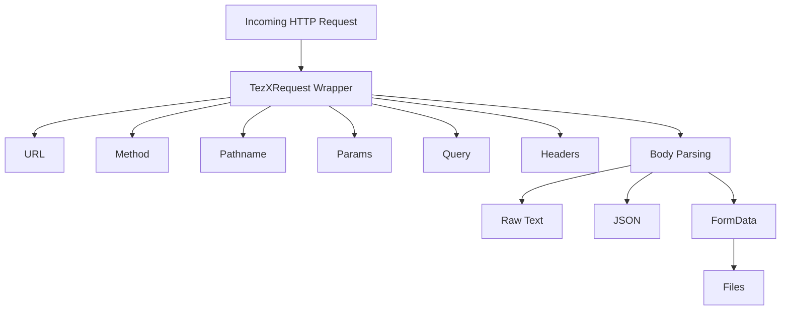

# 📦 TezXRequest — Request Wrapper

`TezXRequest` is a thin wrapper around the native `Request` object.
It makes working with **query params, route params, headers, body parsing, and file uploads** straightforward.

---

## 🗂 Architecture Overview (Mermaid Diagram)



**Explanation:**

* Request comes in → wrapped by `TezXRequest`
* You can directly access **URL, method, pathname, params, query, headers**
* For the body → you can parse as **text, JSON, or FormData** (with file support)

---

## 🔹 Properties

### `url: string`

Full request URL.

```ts
ctx.req.url; 
// "https://example.com/api/user?id=5"
```

---

### `method: HTTPMethod`

HTTP method (GET, POST, PUT, etc).

```ts
ctx.req.method; 
// "POST"
```

---

### `pathname: string`

URL path without query string.

```ts
ctx.req.pathname; 
// "/api/user"
```

---

### `params: Record<string, string>`

Route parameters extracted from the router.

```ts
// Route: /user/:id
ctx.req.params.id; 
// "123"
```

---

### `query: Record<string, string>`

Query string parsed into a plain object.

```ts
// URL: /search?q=js&page=2
ctx.req.query.q;    // "js"
ctx.req.query.page; // "2"
```

---

## 🔸 Methods

### `header(): Record<string, string>`

Get all request headers.

```ts
const headers = ctx.req.header();
console.log(headers["content-type"]); 
// "application/json"
```

---

### `header(name: string): string | undefined`

Get a specific header (case-insensitive).

```ts
const type = ctx.req.header("content-type");
// "application/json"
```

---

### `text(): Promise<string>`

Read raw body as a string.

```ts
const body = await ctx.req.text();
console.log(body); 
// '{"username":"rakib"}'
```

---

### `json<T = any>(): Promise<T>`

Parse body as JSON. Returns `{}` if content-type isn’t JSON or parsing fails.

```ts
const data = await ctx.req.json<{ username: string }>();
console.log(data.username); 
// "rakib"
```

---

### `formData(): Promise<FormData>`

Parse body as `FormData`. Supports:

* `application/x-www-form-urlencoded`
* `multipart/form-data` (with file uploads)

```ts
const form = await ctx.req.formData();
console.log(form.get("name")); 
// "Rakib"

console.log(form.getAll("skills")); 
// ["js", "ts"]
```

---

### ✅ `useFormData<T>()`

Type-safe helper for form parsing.

```ts
import { useFormData } from "tezx/helper";

const data = await useFormData<{ name: string; file: File }>(ctx);

console.log(data.name); // "Rakib"
console.log(data.file); // File object
```

---

## 🛠 Developer Tips

* Use `params` for **dynamic routes**
* Use `query` for **URL query strings**
* Use `header("content-type")` before parsing body
* Use `useFormData` if you need **typed + file-safe** handling
* Always `await` parsing methods (`text()`, `json()`, `formData()`)

---
