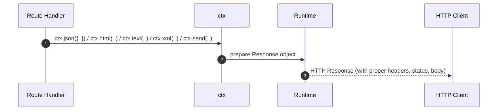

# 🔁 Response Handling in TezX

The **TezX** framework provides a **rich response system** via the `ctx` object.
This system makes it easy to return **JSON, HTML, text, XML, files, redirects, and custom responses** with a clean API.

---



## 🧩 Core Type Definitions

```ts
export type NextCallback = () => Promise<void>; // continue middleware chain

export type HttpBaseResponse = Response | Promise<Response>;

export type Ctx<T extends Record<string, any> = {}, Path extends string = any> =
  Context<T, Path> & T & Record<string, any>;

export type Callback<T = {}, Path extends string = any> =
  (ctx: Ctx<T, Path>) => HttpBaseResponse;

export type Middleware<T = {}, Path extends string = any> =
  (ctx: Ctx<T, Path>, next: NextCallback) =>
    HttpBaseResponse | Promise<HttpBaseResponse | void> | NextCallback;

export type ErrorHandler<T = {}> =
  (err: Error, ctx: Ctx<T>) => HttpBaseResponse;
```

---

## ✅ Native Response

For full control, return a native `Response`:

```ts
app.get("/data", (ctx) => {
  ctx.setHeader("Content-Type", "text/plain" )
  return new Response("Hello World", {
    status: 200,
    headers: ctx.header(),
  });
});
```

---

## 🚀 Response Utilities on `ctx`

### `ctx.json(body, status?, headers?)`

Send JSON.

```ts
app.get("/json", (ctx) => ctx.json({ success: true }, 200));
```

* **Content-Type**: `application/json`

---

### `ctx.html(html, status?, headers?)`

Send HTML.

```ts
app.get("/html", (ctx) => ctx.html("<h1>Welcome</h1>"));
```

* **Content-Type**: `text/html`

---

### `ctx.text(text, status?, headers?)`

Send plain text.

```ts
app.get("/plain", (ctx) => ctx.text("Just text"));
```

* **Content-Type**: `text/plain`

---

### `ctx.xml(xml, status?, headers?)`

Send XML.

```ts
app.get("/xml", (ctx) => ctx.xml("<note><msg>Hi</msg></note>"));
```

* **Content-Type**: `application/xml`

---

### `ctx.send(body, status?, headers?)`

Smart responder (auto-detects type).

```ts
app.get("/send", (ctx) => ctx.send({ user: "admin" }));
```

* `object` → JSON
* `string` → plain text
* `Buffer`/`Uint8Array` → binary

---

### `ctx.redirect(url, status?, headers?)`

Redirect user.

```ts
app.get("/go", (ctx) => ctx.redirect("https://example.com"));
```

* **Default Status**: `302`
* **Header**: `Location`

---

### `ctx.download(filePath, fileName)`

Trigger file download.

```ts
app.get("/download", (ctx) => 
  ctx.download("/files/report.pdf", "Monthly-Report.pdf")
);
```

* **Header**: `Content-Disposition: attachment`

---

### `ctx.sendFile(filePath, fileName?)`

Serve static file.

```ts
app.get("/image", (ctx) => ctx.sendFile("/assets/banner.jpg"));
```

* Auto sets `Content-Type`
* Streams file efficiently

---

## 🛠 Best Practices

| Use Case               | Recommended Method |
| ---------------------- | ------------------ |
| JSON API response      | `ctx.json()`       |
| HTML rendering         | `ctx.html()`       |
| Plain text output      | `ctx.text()`       |
| XML feeds / APIs       | `ctx.xml()`        |
| Dynamic content (auto) | `ctx.send()`       |
| External redirects     | `ctx.redirect()`   |
| Secure file download   | `ctx.download()`   |
| Static asset serving   | `ctx.sendFile()`   |
| Full manual control    | Native `Response`  |

---
