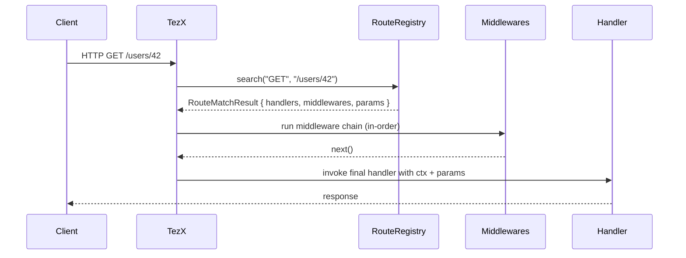

# TezX Route Registry

## Quick overview

TezX uses a `RouteRegistry` to store and match routes. A `Router` (or the top-level `TezX` server) delegates route registration and lookup to a `RouteRegistry` implementation. You can provide the built-in registry or implement your own `CustomRouter` if you need different behavior (radix tree, trie, high-performance matcher, custom param parsing, etc.).

This doc assumes basic TypeScript knowledge.

---

## Install & import

```ts
// package name: tezx
import { TezX, Router, Middleware, Callback, HTTPMethod } from "tezx";
```

---

## Core types & interfaces (simplified)

```ts
export type RouteMatchResult<T extends Record<string, any> = any> = {
  method: HTTPMethod;
  middlewares: Middleware<T>[];
  handlers: HandlerType<T>;
  params: Record<string, string | null | undefined>;
};

export type HandlerType<T extends Record<string, any> = any> = (
  | Callback<T>
  | Middleware<T>
)[];

export interface RouteRegistry {
  name: string;
  addRoute<T extends Record<string, any> = any>(
    method: HTTPMethod,
    path: string,
    handler: HandlerType<T>,
  ): void;
  search(method: HTTPMethod, path: string): RouteMatchResult;
}
```

> Short note: `ALL` is conventionally used for "attach to all methods" (common for middlewares).

---

## What you’ll implement in a `CustomRouter`

Minimal responsibilities:

1. store registered routes and their handlers/middlewares
2. match an incoming `method` + `path` and return a `RouteMatchResult`
3. allow wildcard/middleware routes (e.g. `method = "ALL"`) and sub-routers (optional)

A high-level `addRoute` + `search` is all TezX needs. The rest is implementation detail.

---

## Example: a simple `CustomRouter` implementation (radix/trie-free but clear)

> This is a **drop-in** example you can expand (add performance, caching, param parsing).

```ts
// CustomRouter.ts
import type { RouteRegistry, RouteMatchResult, HTTPMethod, HandlerType } from "tezx";

type RouteNode = {
  path: string; // exact or param pattern like ":id" or "*"
  method: HTTPMethod;
  handlers: HandlerType;
};

export class CustomRouter implements RouteRegistry {
  name = "custom-router";
  private routes: RouteNode[] = [];

  addRoute(method: HTTPMethod, path: string, handlers: HandlerType) {
    // normalize path (remove trailing slash except root)
    const p = path === "/" ? "/" : path.replace(/\/$/, "");
    this.routes.push({ path: p, method, handlers });
  }

  search(method: HTTPMethod, path: string) : RouteMatchResult {
    const p = path === "/" ? "/" : path.replace(/\/$/, "");

    // 1) exact match
    for (const r of this.routes) {
      if ((r.method === method || r.method === "ALL") && r.path === p) {
        return {
          method: r.method,
          middlewares: r.handlers.filter(Boolean) as any,
          handlers: r.handlers,
          params: {},
        } as RouteMatchResult;
      }
    }

    // 2) simple param match (e.g. /users/:id)
    for (const r of this.routes) {
      if (r.method !== method && r.method !== "ALL") continue;
      const routeParts = r.path.split("/").filter(Boolean);
      const urlParts = p.split("/").filter(Boolean);
      if (routeParts.length !== urlParts.length) continue;

      const params: Record<string, string> = {};
      let matched = true;
      for (let i = 0; i < routeParts.length; i++) {
        const rp = routeParts[i];
        const up = urlParts[i];
        if (rp.startsWith(":")) {
          params[rp.slice(1)] = decodeURIComponent(up);
          continue;
        }
        if (rp === "*") continue;
        if (rp !== up) {
          matched = false;
          break;
        }
      }

      if (matched) {
        return {
          method: r.method,
          middlewares: r.handlers.filter(Boolean) as any,
          handlers: r.handlers,
          params,
        } as RouteMatchResult;
      }
    }

    // 3) not found — return empty result (TezX may treat as 404)
    return {
      method,
      middlewares: [],
      handlers: [],
      params: {},
    } as RouteMatchResult;
  }
}
```

---

## How TezX uses the registry (sequence diagram)



---

## Example: register routes & start server

```ts
import { TezX, Router } from "tezx";
import { CustomRouter } from "./CustomRouter";

const app = new TezX({
  debugMode: true,
  routeRegistry: new CustomRouter(),
  env: { /* your env */ },
});

// Using Router helper (sub-router) — Router will call into the provided routeRegistry
const router = new Router({ routeRegistry: new CustomRouter() });

// handlers
const authMiddleware: Middleware<any> = async (ctx, next) => {
  if (!ctx.user) throw new Error("unauthenticated");
  await next();
};

const getUser: Callback<any> = async (ctx) => {
  const id = ctx.params.id;
  ctx.res.json({ id, name: "User" + id });
};

// register
app.get("/users/:id", [authMiddleware, getUser]);

// or via app convenience method (if TezX exposes one)
router.post("/users", [async (ctx) => {/*...*/}]);


```

---

## API Reference (cheat-sheet)

* `RouteRegistry.name: string` — identifier.
* `addRoute(method, path, handler)` — register route or middleware. `method = "ALL"` for global.
* `search(method, path) -> RouteMatchResult` — returns handlers, middlewares and `params`.

---

## Common extensions you might add

* `priority` or `order` for routes so specific routes beat wildcard routes.
* compiled regex for param routes (`/users/:id(\\d+)`).
* method groups (e.g. `GET|POST`) and versioned routes (`/v1/users`).
* route metadata (auth roles, rate limits) stored in the route node.

---
