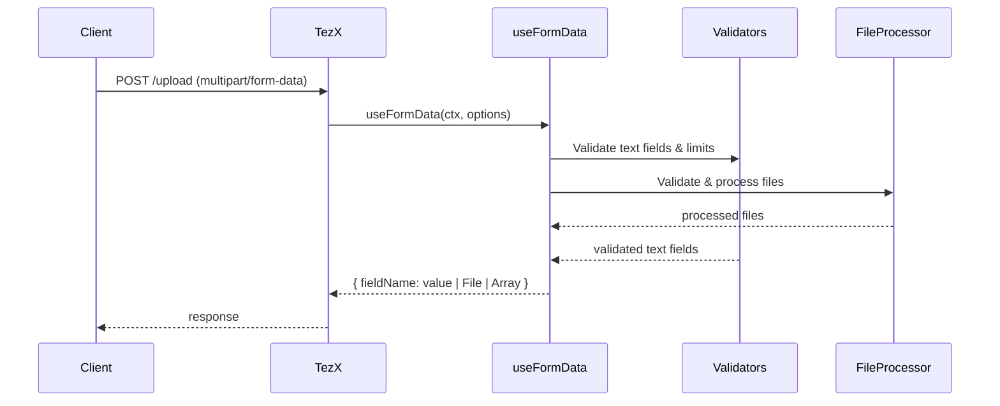

# 🚀 `useFormData` — Multipart Form & File Upload Handler

`useFormData` is a powerful helper designed for efficient parsing, validation, and management of **multipart/form-data** HTTP requests in TezX applications. It simplifies handling complex file uploads combined with form fields while enforcing strict limits to protect your server from overload and security risks.



---

## 🔧 Function Signature

```ts
import { Context,FormDataOptions } from "tezx";

export async function useFormData(
  ctx: Context,
  options?: FormDataOptions
): Promise<Record<string, string | File | (string | File)[]>>;
```

---

## 🔥 Core Features

* **Full multipart/form-data parsing** for text fields and file uploads
* **Automatic merging** of repeated fields into arrays
* **File validation:**

  * MIME type whitelist
  * Max file size per file
  * Max number of files per field
  * Max total upload size (combined all files)
* **Text field validation:**

  * Max size per text field (bytes/characters)
  * Optional sanitization (trimming, escaping)
* **Streaming-aware file processing** for large uploads (configurable)
* Detailed **error handling** with descriptive messages
* Easily **extensible** to add custom file processors or virus scanners

---

## 🔹 Parameters

| Name      | Type              | Description                                                         |
| --------- | ----------------- | ------------------------------------------------------------------- |
| `ctx`     | `Context`         | TezX request context with the incoming multipart HTTP request       |
| `options` | `FormDataOptions` | Optional configuration object to control validations and processing |

---

## 🔸 Returns

Promise resolving to an object mapping field names to:

* **string** — for text form fields
* **File** — for single uploaded files
* **Array\<string | File>** — for repeated fields (multiple values/files)

---

## ⚙️ FormDataOptions Interface

| Property       | Type       | Description                                                                     |
| -------------- | ---------- | ------------------------------------------------------------------------------- |
| `sanitized`    | `boolean`  | Enables sanitization of text inputs (trimming, escaping, etc.)                  |
| `allowedTypes` | `string[]` | MIME types allowed for file uploads (e.g., `["image/jpeg", "application/pdf"]`) |
| `maxSize`      | `number`   | Maximum size (in bytes) allowed per individual file                             |
| `maxFiles`     | `number`   | Maximum number of files accepted per single field                               |
| `maxTotalSize` | `number`   | Maximum combined size (in bytes) allowed for all files in the request           |
| `maxFieldSize` | `number`   | Maximum allowed length (characters or bytes) for text fields                    |

---

## 🔍 Detailed Behavior

### 1. **Multipart Form Parsing**

The function calls `ctx.req.formData()` internally to parse the multipart form. It then iterates over all fields and files, applying the configured validations.

### 2. **File Handling**

* **File Size:** Each file is checked against the `maxSize` option. Files exceeding this size are rejected immediately.
* **File Count:** Enforces a strict maximum number of files per field via `maxFiles`.
* **MIME Type Validation:** If `allowedTypes` is specified, files not matching allowed MIME types are rejected.
* **Total Upload Size:** Keeps a running total of all uploaded file bytes and throws if the `maxTotalSize` is exceeded.
* **Extensible Processing:** Internally calls a customizable `processFile` function for potential streaming, virus scanning, or on-the-fly compression.

### 3. **Text Field Handling**

* Checks each string field against `maxFieldSize` for length.
* Optionally sanitizes text fields when `sanitized` is enabled (trimming whitespace, escaping dangerous chars).

### 4. **Duplicate Field Names**

Fields with the same name are grouped into arrays, supporting inputs like:

```html
<input type="file" name="photos" multiple>
<input type="text" name="tags">
<input type="text" name="tags">
```

---

## 🛡️ Error Handling & Security

* Throws clear, actionable errors on exceeding any configured limits (size, count, type).
* Prevents large unexpected uploads from exhausting memory or disk space.
* Supports input sanitization to prevent injection or XSS attacks from text fields.
* Encourages defining strict `allowedTypes` and `maxSize` to avoid malicious uploads.

---

## ⚡ Example Usage (Robust File Upload)

```ts
import { useFormData } from "tezx/helper";

async function uploadHandler(ctx: Context) {
  try {
    const form = await useFormData(ctx, {
      allowedTypes: ["image/jpeg", "image/png", "application/pdf"],
      maxSize: 10 * 1024 * 1024,       // 10MB max per file
      maxFiles: 5,                     // Max 5 files per field
      maxTotalSize: 50 * 1024 * 1024, // 50MB combined limit
      maxFieldSize: 2000,              // Max 2000 chars for text fields
      sanitized: true,                 // Trim & sanitize text inputs
    });

    // Access text fields and files
    const username = form["username"];
    const profilePics = form["photos"]; // Array of File objects

    // Process or store files
    for (const file of Array.isArray(profilePics) ? profilePics : [profilePics]) {
      // e.g. save to disk, cloud storage, virus scan, etc.
      console.log(`Uploading file: ${file.name} (${file.size} bytes)`);
    }

    return ctx.text("Upload successful!");
  } catch (err) {
    // Handle validation errors
    return ctx.status(400).text(err.message);
  }
}
```

---
